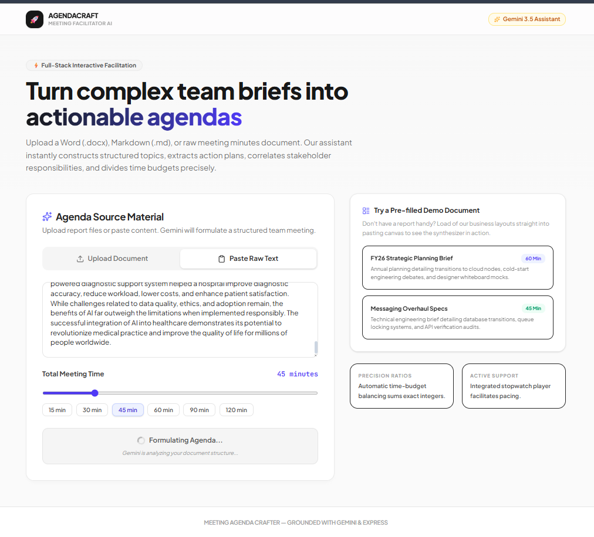
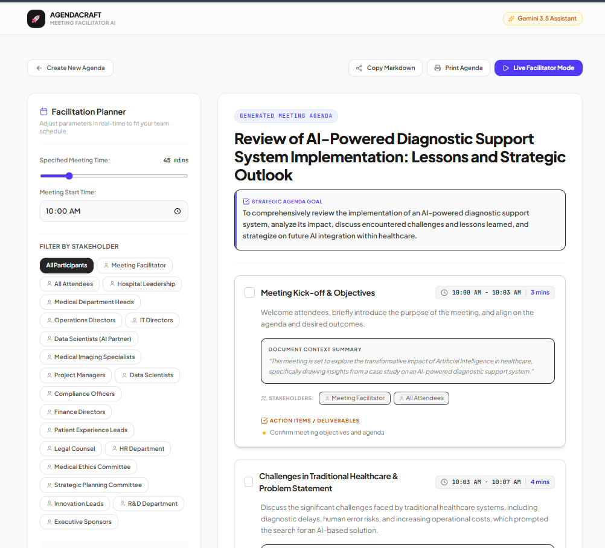
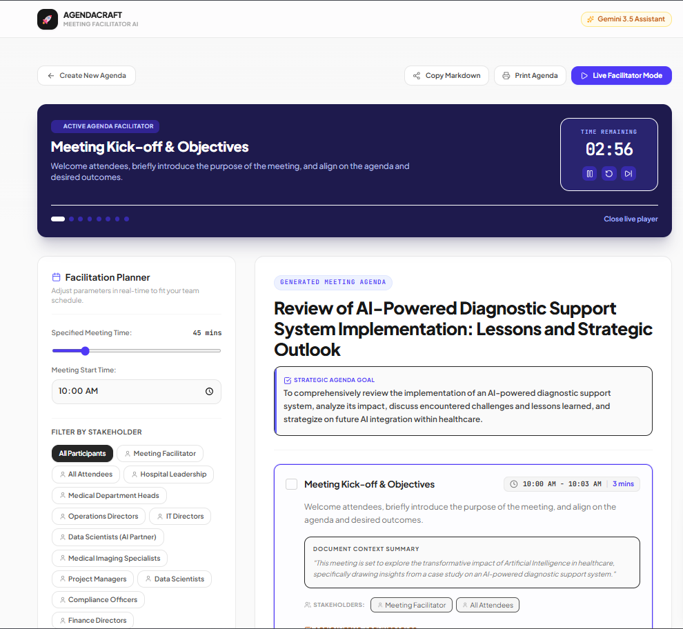

<div align="center">

# 🚀 AgendaCraft
### AI-Powered Meeting Agenda Generator

**Transform unstructured team briefs, reports, and meeting notes into precise, time-budgeted agendas — in seconds.**

[](https://react.dev)
[](https://www.typescriptlang.org)
[](https://nodejs.org)
[](https://ai.google.dev)
[](https://tailwindcss.com)
[](https://vitejs.dev)

</div>

---

## 📸 Screenshots

### 🏠 Home Page



The landing page where users upload documents and generate AI-powered agendas.

---

### 📋 Generated Meeting Agenda



AI-generated agenda with stakeholders, action items, and time allocation.

---

### ⏱️ Live Facilitator Mode



Real-time meeting facilitation with countdown timer and agenda tracking.

---

## 📌 Overview

**AgendaCraft** is a full-stack web application that leverages Google's Gemini AI to intelligently parse source documents — project briefs, technical specs, email threads, or raw meeting notes — and automatically generate structured, time-allocated meeting agendas.

The app goes beyond simple summarization: it extracts stakeholder ownership, maps action items to relevant owners, and distributes agenda time proportionally based on the complexity of each topic. An integrated live facilitation mode lets meeting hosts run the session in real time with a built-in countdown timer, agenda progression controls, and print-ready export.

---

## ✨ Key Features

| Feature | Description |
|---|---|
| **AI Agenda Generation** | Powered by Gemini 2.5 Flash/Pro with automatic model fallback and exponential backoff retry logic |
| **Multi-Format Document Ingestion** | Accepts `.docx` (via Mammoth.js), `.md`, `.txt`, and raw text paste — up to 50MB |
| **Intelligent Time Allocation** | Proportional time distribution algorithm that ensures agenda item durations sum precisely to the specified meeting length |
| **Live Facilitation Mode** | Real-time countdown timer per agenda section, skip/pause/reset controls, and automatic item progression |
| **Stakeholder Filtering** | Filter the entire agenda view by individual stakeholder to instantly surface their responsibilities |
| **Computed Timetable** | Generates actual wall-clock start and end times for every agenda item based on configurable meeting start time |
| **Print & Export** | Clean print-ready agenda layout with one-click browser print support |
| **Copy to Clipboard** | One-click copy of the full structured agenda as formatted plain text |
| **Demo Documents** | Pre-loaded sample business documents to showcase AI capabilities instantly |
| **Animated UI** | Smooth page transitions and state animations using Framer Motion |

---

## 🏗️ Architecture

```
AgendaCraft/
├── server.ts                  # Express backend — document parsing & Gemini API integration
├── src/
│   ├── App.tsx                # Root component — state management & API orchestration
│   ├── main.tsx               # React app entry point
│   ├── types.ts               # Shared TypeScript interfaces (AgendaItem, MeetingAgenda)
│   ├── index.css              # Global styles (Tailwind v4)
│   └── components/
│       ├── UploadForm.tsx     # Document upload UI — file picker, text paste, settings
│       └── AgendaViewer.tsx   # Agenda display, live timer, stakeholder filter, export
├── vite.config.ts             # Vite + React plugin configuration
├── tsconfig.json              # TypeScript compiler options
└── package.json               # Scripts & dependencies
```

**Architecture Pattern:** The app uses a single-server full-stack model — Express serves both the REST API (`/api/generate-agenda`) and the Vite-compiled React SPA. In development, Vite runs as Express middleware for HMR.

---

## 🤖 AI Pipeline

```
User Document / Text Input
         │
         ▼
  Express POST /api/generate-agenda
         │
         ├─── .docx → Mammoth.js → raw text
         ├─── .md / .txt → UTF-8 decode
         └─── text paste → direct
         │
         ▼
  Gemini Prompt (system instruction + source material)
  Model cascade: gemini-2.5-flash → gemini-2.5-pro → gemini-1.5-flash → gemini-1.5-pro
  (exponential backoff: 1s → 2s → 4s per attempt, 3 attempts per model)
         │
         ▼
  Structured JSON response (enforced via responseSchema)
         │
         ▼
  MeetingAgenda { title, goal, agendaItems[] }
  → React state → AgendaViewer
```

The Gemini API is called with `responseMimeType: "application/json"` and a strict `responseSchema`, guaranteeing type-safe structured output without any post-processing regex or parsing fragility.

---

## 🛠️ Tech Stack

**Frontend**
- [React 19](https://react.dev) — UI framework
- [TypeScript 5.8](https://www.typescriptlang.org) — Type safety across the full stack
- [Tailwind CSS v4](https://tailwindcss.com) — Utility-first styling
- [Framer Motion](https://www.framer.com/motion/) — Declarative animations & page transitions
- [Lucide React](https://lucide.dev) — Icon system

**Backend**
- [Node.js + Express](https://expressjs.com) — REST API server
- [Mammoth.js](https://github.com/mwilliamson/mammoth.js) — `.docx` to plain text extraction
- [@google/genai](https://ai.google.dev) — Official Gemini SDK

**Tooling**
- [Vite 6](https://vitejs.dev) — Frontend build & dev server (middleware mode)
- [esbuild](https://esbuild.github.io) — Server TypeScript bundling for production
- [tsx](https://github.com/privatenumber/tsx) — TypeScript execution for development

---

## 🚀 Getting Started

### Prerequisites

- **Node.js** v18 or higher
- A **Gemini API key** — get one free at [Google AI Studio](https://ai.google.dev)

### Installation

```bash
# 1. Clone the repository
git clone https://github.com/SauravVenu/AgendaCraft.git
cd AgendaCraft

# 2. Install dependencies
npm install

# 3. Configure environment
cp .env.local.example .env.local
# Add your Gemini API key:
# GEMINI_API_KEY=your_key_here

# 4. Start the development server
npm run dev
```

Open [http://localhost:3000](http://localhost:3000) in your browser.

### Production Build

```bash
npm run build    # Compiles React SPA + bundles Express server
npm start        # Runs the production server at port 3000
```

---

## 📸 How It Works

**1. Upload or Paste Your Document**
Upload a `.docx`, `.md`, or `.txt` file — or paste raw meeting notes directly. Set your total meeting duration (e.g., 60 minutes) and the planned start time.

**2. AI Generates a Structured Agenda**
Gemini analyzes the source material and returns a fully structured agenda with section titles, background context, discussion descriptions, stakeholder owners, and action items — all time-weighted by topic complexity.

**3. Review & Facilitate**
Browse your agenda by section. Filter the view to a specific stakeholder. Switch to **Live Mode** to run the session in real time: a countdown timer tracks each section, with controls to pause, skip ahead, or reset. When done, print or copy the complete agenda.

---

## 💡 Design Decisions

- **Model Cascade with Backoff** — Rather than hard-failing on API quota errors, the server iterates through multiple Gemini model versions with per-attempt delays, maximizing availability under load.
- **Precise Time Allocation** — A remainder-redistribution algorithm ensures that integer minute values across all agenda items always sum exactly to the specified total meeting time — no rounding drift.
- **Schema-Enforced AI Output** — Using Gemini's `responseSchema` parameter guarantees the AI response is always valid JSON matching the `MeetingAgenda` type, eliminating brittle regex parsing.
- **Single-Server Architecture** — The Express server hosts both the API and the SPA, simplifying deployment to any Node.js-capable environment with zero additional infrastructure.

---

## 📁 API Reference

### `POST /api/generate-agenda`

Generates a structured meeting agenda from a source document or text.

**Request Body**
```json
{
  "fileBase64": "base64-encoded file content (optional)",
  "fileName": "report.docx (optional)",
  "fileType": "application/vnd.openxmlformats-officedocument.wordprocessingml.document (optional)",
  "textPaste": "raw text content (optional, used if no file)"
}
```

**Response**
```json
{
  "success": true,
  "extractedLength": 2048,
  "data": {
    "meetingTitle": "FY26 Strategic Planning Review",
    "meetingGoal": "Align engineering, design, and leadership on cloud migration priorities.",
    "agendaItems": [
      {
        "id": "sec-1",
        "title": "Architecture Overview",
        "description": "Review proposed Kubernetes node configuration.",
        "summary": "Transition from legacy desktop to cloud containers is estimated to boost engagement by 22%.",
        "stakeholders": ["Dave Ross", "Sarah Jenkins"],
        "actionItems": ["Dave to present performance benchmarks", "Sarah to approve compute budget"],
        "timeWeight": 25
      }
    ]
  }
}
```

---

## 🔮 Future Enhancements

- [ ] Export agenda as formatted `.docx` or `.pdf`
- [ ] Google Calendar / Outlook event creation integration
- [ ] Multi-language agenda generation support
- [ ] User authentication and agenda history persistence
- [ ] Collaborative real-time agenda editing (multi-user)
- [ ] Slack/Teams bot integration for agenda distribution

---

## 👤 Author

**Saurav Venu**
Computer Science Student | Full-Stack Developer

[](https://github.com/SauravVenu)

---

## 📄 License

This project is open source and available under the [MIT License](LICENSE).

---

<div align="center">
<sub>Built with React, Express, TypeScript, and Google Gemini AI</sub>
</div>
